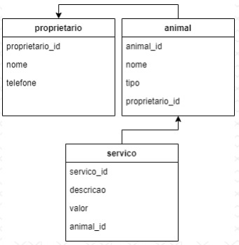
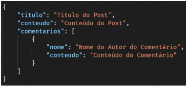

<h1 align="center">igti-node-modulo-3-challenge</h1>

[🔙 Voltar para página principal](../README.md)

# Enunciado do desafio

## Objetivos

Exercitar os conceitos trabalhados no módulo, para criação de uma API utilizando Node.js e Express com integração aos bancos de dados PostgresSQL e MongoDB.

## Enunciado

Utilizando o mesmo projeto desenvolvido no Trabalho Prático, o "petshop-api", o Desafio consiste em refatorar o projeto antigo, criar novos endpoints para controlar os serviços realizados pelos animais e para a gestão do blog do petshop.

## Atividades

O desafio final possui três partes, todas sendo realizadas no mesmo projeto desenvolvido no Trabalho Prático, o "petshop-api".

A primeira consiste em refatorar o projeto criado anteriormente, introduzindo o Sequelize. O aluno deverá realizar o mapeamento das tabelas "proprietarios" e "animais", e atualizar a camada "repository" para utilizar o Sequelize, conforme visto nas aulas gravadas.

A segunda consiste em criar a tabela e os endpoints necessários para controlar os serviços realizados pelos animais no petshop. No trabalho prático foi fornecido os comandos de criação das tabelas, já agora no desafio essa tarefa é parte do trabalho, ficando sob responsabilidade do aluno. A nova tabela no banco de dados PostgreSQL
deverá ter os seguintes campos:

**Tabela: servicos**
- `servico_id` (SERIAL, não nulo) – chave primária da tabela. Identificador único
do registro, gerado automaticamente no momento da inserção.
- `descricao` (STRING, não nulo) – descrição do serviço realizado.
- `valor` (NUMERIC, não nulo) – valor do serviço realizado.
- `animal_id` (INT, não nulo) – chave estrangeira para a tabela de animal. Faz referência a qual animal foi realizado o serviço em questão.

A nova modelagem do banco de dados após a criação desta tabela é a seguinte:

Os endpoints que deverão ser criados estão listados abaixo. Será opcional a implementação dos endpoints de atualização, exclusão e busca por serviço e específico.

**Endpoints**

1. Cadastrar um serviço realizado:
- URL: http://localhost:3000/servico
- Método HTTP: POST
- Parâmetros: objeto JSON com a descrição e valor do serviço e o id do animal o qual o serviço foi realizado.

2. Consultar os serviços cadastrados (retornar todos os serviços realizados):
- URL: http://localhost:3000/servico
- Método HTTP: GET
- Parâmetros: sem parâmetros.

3. Consulta dos serviços realizados em animais de determinado proprietário (pegar o id do proprietário na URL e retornar um objeto JSON com os serviços realizados
por seus animais):
- URL: http://localhost:3000/servico?proprietario_id={proprietario_id}
- Método HTTP: GET
- Parâmetros: id do proprietário passado diretamente na URL, exemplo de um id de valor 15 passado na URL:
http://localhost:3000/servico?proprietario_id=15 (Sugestão: pode ser usado a mesma estrutura do endpoint do item 2 que consulta todos os serviços, só que aqui, nesse caso, ele receberia um parâmetro para filtrar o proprietário).

A terceira parte consiste em criar a estrutura para que o petshop possa criar o seu blog. Essa estrutura deverá ser criada em MongoDB. Sugerimos que seja criada uma instância gratuita no MongoDB Atlas, conforme visto nas aulas gravadas, porém caso o aluno prefira outro servidor, ou até mesmo localmente, não tem problema.

Deverá ser criada uma collection chamada "posts", que será responsável por armazenar os posts do blog. Cada post deverá ter uma propriedade para o título, outra para o conteúdo e uma lista de comentários, sendo que cada comentário deve ter o nome de quem fez o comentário e o conteúdo. Segue abaixo um exemplo dessa estrutura:

Após ter criado a estrutura no MongoDB, o aluno deverá desenvolver endpoints para cadastro de um post, consulta de todos os posts e seus comentários, e cadastro de comentários. Segue abaixo a descrição dos endpoints:

1. Cadastro de um post:
- URL: http://localhost:3000/post
- Método HTTP: POST
- Parâmetros: objeto JSON com o título e descrição do post.

2. Consulta de todos os posts (retornar uma lista com todos os posts, sendo cada post representado por um objeto JSON com todas as propriedades, incluindo os comentários de cada post):
- URL: http://localhost:3000/post
- Método HTTP: GET
- Parâmetros: sem parâmetros.

3. Cadastro de um comentário:
- URL: http://localhost:3000/comentario
- Método HTTP: POST
- Parâmetros: objeto JSON com o id do post, nome do autor do comentário e o conteúdo do comentário. Observação: o id do post que será utilizado é a propriedade "_id", um ObjectId gerado automaticamente pelo MongoDB. Para filtrar um post em específico pelo seu id, o filtro é parecido com o seguinte: `{"_id": ObjectId("60c667caeb7c167026bcc96a")}`

Antes de responder o questionário, o aluno deverá recriar o banco de dados do PostgreSQL, apagar os registros do banco de dados do MongoDB e realizar os inserts do arquivo fornecido juntamente com este enunciado.

É importante que o aluno recrie o banco de dados do PostgreSQL, pois caso contrário os ids dos registros poderão não bater com os do questionário, gerando assim respostas incorretas.

[🔙 Voltar para página principal](../README.md)